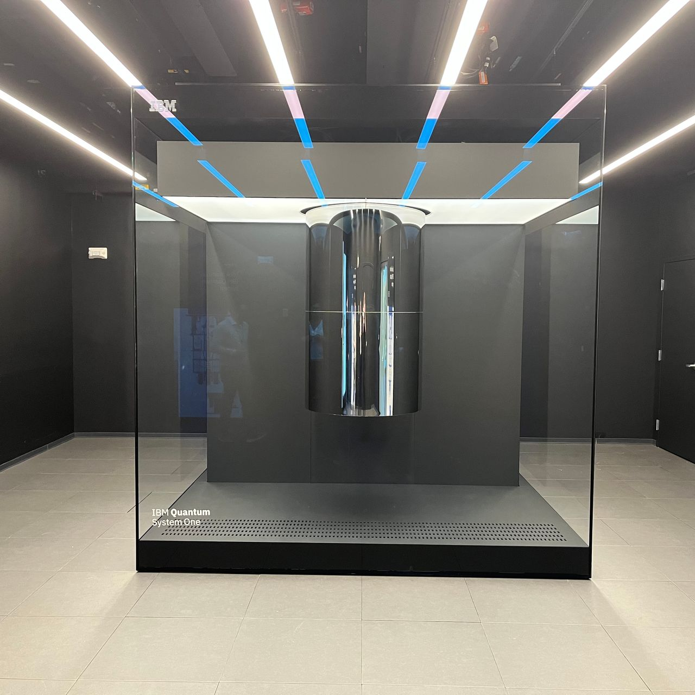
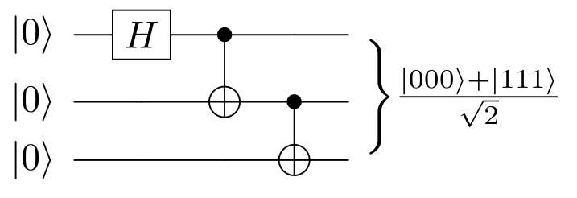

# Qiskit-Python-Gateway-to-Quantum-Information-Science
An exploration of the Qiskit, an SDK for quantum information science in Python.

Qiskit is a software development kit (SDK) is a comprehensive platform for quantum programming. 
At the heart of Qiskit are its elements - Terra, Aer, Ignis, and Aqua - each playing a crucial role in the quantum 
computing ecosystem. 

## Terra: The Foundation

Terra, named after the 'earth' element, is the bedrock of Qiskit. It allows for composing quantum programs at the level of circuits and pulses, optimizing them for specific quantum devices, and managing the execution of experiments on remote-access devices. Terra is where quantum circuits are defined, manipulated, and optimized for performance on various backends.

Key Features:

- Quantum Circuits: Design and execute sequences of quantum operations.

- Pulse Scheduling: Customize quantum operations at a lower level for precision control.

- Transpiler: Optimize quantum circuits for specific quantum devices.

- Providers and Backends: Interface with quantum hardware and simulators.

- Jobs and Results: Manage and retrieve the results of quantum experiments.

## Aer: The Quantum Simulator

Aer, representing the 'air' element, offers powerful simulators for quantum circuits. It helps in understanding the limits of classical processors in mimicking quantum computation and provides tools for simulating realistic noise on quantum computations.

Key Features:

- Multiple simulation backends (QasmSimulator, StatevectorSimulator, UnitarySimulator).
- Noise modeling for realistic quantum circuit simulation.

## Ignis: The Noise Mitigator

Ignis, the 'fire' element, focuses on identifying, characterizing, and mitigating quantum noise and errors. It is essential for improving the fidelity of quantum operations and for developing quantum error correction techniques.

Key Features:

- Error characterization and mitigation.
- Gate and circuit performance verification.

## Aqua: Quantum Algorithms

Aqua, the 'water' element, brings life to quantum computing applications. It contains algorithms that can be used across various domains such as chemistry, optimization, finance, and AI, demonstrating the practical use of quantum computing.

Key Features:

- Domain-specific quantum algorithms.
- Integration with classical algorithms for hybrid solutions.

## Simulating the GHZ State

The Greenberger-Horne-Zeilinger (GHZ) demonstrates some peculiarities of quantum entanglement across 
multiple particles or qubits. Initially studied in the context of four particles by Daniel Greenberger, Michael Horne, and Anton Zeilinger in 1989, 
and later expanded to three particles by N. David Mermin in 1990, GHZ states involve at least three subsystems that are 
interconnected in such a way that the state of each particle cannot be described independently of the others.

GHZ states are known for their "extremely non-classical properties," which means they exhibit behaviors that 
cannot be explained by classical physics. One of the hallmark characteristics of GHZ states is their ability to 
demonstrate quantum entanglement more starkly than simpler entangled states, such as the Bell states, which involve 
only two particles. This makes GHZ states a powerful tool for probing the foundations of quantum mechanics and for 
illustrating the differences between classical and quantum theories.

In practical terms, GHZ states are not just a theoretical curiosity; they hold promise for enhancing the 
performance of quantum technologies. For instance, in quantum metrology, GHZ states of a large number of 
qubits are theorized to offer superior precision compared to other qubit superposition states. This potential 
makes GHZ states a key area of research in the ongoing development of quantum computing and quantum information 
science, as they could enable more accurate measurements and more powerful quantum algorithms.

The notebook in this repositiory explores the fundamentals of the Quiskit SDK for quantum programming through an exploration of the GHZ state. 

